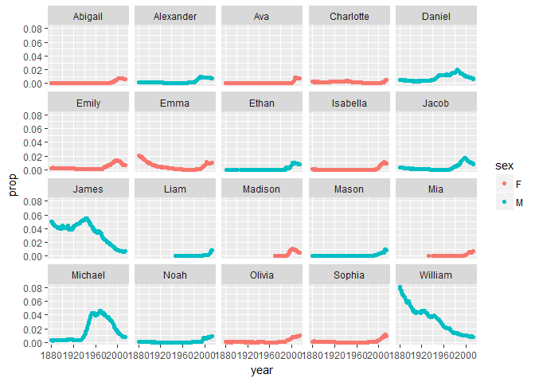
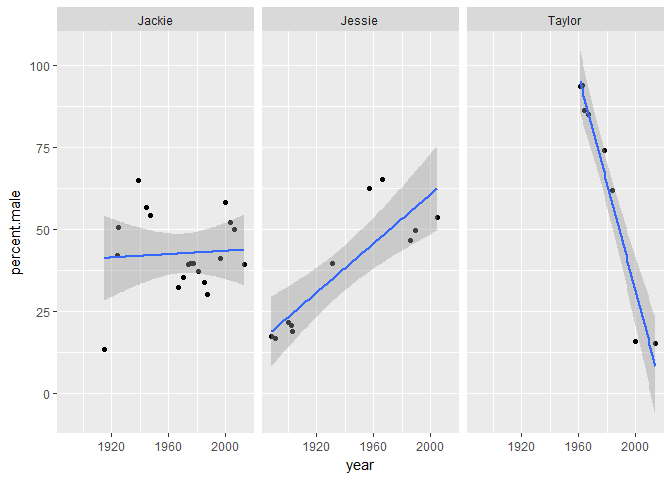

# Task 07 - R Notebook

##Introduction

This R Markdown Notebook has been created for as part of Task 06 for the course GEOL 590. This task is an introduction to using the **dplyr** package with the built-in datasets **nycflights13** and **babynames**.

##Assigned tasks

* Using the `nycflights13::weather`:
    * Determine whether there are any clear outliers in wind speed (`wind_speed`) that should be rejected. If so, filter those bad point(s) and proceed.
    * What direction has the highest median speed at each airport? Make a table and a plot of median wind speed by direction, for each airport. *Optional fun challenge: If you like, this is a rare opportunity to make use of `coord_polar()`.*
    

```r
library(tidyverse) #Loads the packages associated with the tidyverse
```

```
## Loading tidyverse: ggplot2
## Loading tidyverse: tibble
## Loading tidyverse: tidyr
## Loading tidyverse: readr
## Loading tidyverse: purrr
## Loading tidyverse: dplyr
```

```
## Conflicts with tidy packages ----------------------------------------------
```

```
## filter(): dplyr, stats
## lag():    dplyr, stats
```

```r
library(nycflights13) #Loads the nycflights dataset

#Calculates median wind speed of data by airport and direction for use in table and plot
median_wind_speed <- weather %>%
  group_by(origin, wind_dir) %>%
  select(origin, wind_dir, wind_speed) %>%
  #Filters out large outlier in wind speed as well as data for which there is no wind direction specified
  filter(wind_speed < 50, wind_dir != "NA", wind_dir != "0") %>%
  summarise(Median.Wind.Speed = median(wind_speed, na.rm = TRUE)) %>%
  rename(Wind.Direction = wind_dir, Origin = origin) %>%
  print()
```

```
## Source: local data frame [108 x 3]
## Groups: Origin [3]
## 
##    Origin Wind.Direction Median.Wind.Speed
##     <chr>          <dbl>             <dbl>
## 1     EWR             10           9.20624
## 2     EWR             20           9.20624
## 3     EWR             30           9.20624
## 4     EWR             40          10.35702
## 5     EWR             50           8.05546
## 6     EWR             60           8.05546
## 7     EWR             70           6.90468
## 8     EWR             80           6.90468
## 9     EWR             90           6.32929
## 10    EWR            100           6.90468
## # ... with 98 more rows
```

```r
#Makes a plots of median wind speed as a function of wind direction by airport
wind_speed_plot <- ggplot(median_wind_speed, aes(Wind.Direction, Median.Wind.Speed, color = Median.Wind.Speed)) +
  geom_point() +
  facet_wrap(~Origin) +
  labs(x = "Wind direction", y = "Median wind speed (mph)")

print(wind_speed_plot)
```

<!-- -->

* Using `nycflights13::flights` and `nycflights13::airlines`:
    * Make a table with two columns: airline name (not carrier code) and median distance flown from JFK airport. The table should be arranged in order of decreasing mean flight distance. Hint: use a `_join` function to join `flights` and `airlines`.
    

```r
#Joins the flights and airlines datatables together so full airline names may be displayed
flights_and_airlines <- inner_join(flights, airlines, by = "carrier")

#Calculates the median distance of flights that leave from JFK by airline
median_dist_by_airline <- flights_and_airlines %>%
  select(name, origin, distance) %>%
  filter(origin == "JFK") %>%
  group_by(name) %>%
  summarise(Median.Distance = median(distance)) %>%
  arrange(Median.Distance) %>%
  print()
```

```
## # A tibble: 10 × 2
##                        name Median.Distance
##                       <chr>           <dbl>
## 1  ExpressJet Airlines Inc.             228
## 2                 Envoy Air             425
## 3         Endeavor Air Inc.             427
## 4           US Airways Inc.             541
## 5           JetBlue Airways            1028
## 6    American Airlines Inc.            1598
## 7      Delta Air Lines Inc.            1990
## 8            Virgin America            2475
## 9     United Air Lines Inc.            2586
## 10   Hawaiian Airlines Inc.            4983
```

* Make a *wide-format* data frame that displays the number of flights that leave Newark ("EWR") airport each month, from each airline


```r
library(reshape2) #Loads the reshape2 package for transforming data format
```

```
## 
## Attaching package: 'reshape2'
```

```
## The following object is masked from 'package:tidyr':
## 
##     smiths
```

```r
#Calculates the number of flights that leave Newark each month by airline
num_flights_from_EWR <- flights_and_airlines %>%
  select(name, origin, month) %>%
  filter(origin == "EWR") %>%
  group_by(month, name) %>%
  summarise(Number.of.flights = length(name)) %>%
  dcast(name ~ month) %>%
  print()
```

```
## Using Number.of.flights as value column: use value.var to override.
```

```
##                        name    1    2    3    4    5    6    7    8    9
## 1      Alaska Airlines Inc.   62   56   62   60   62   60   62   62   60
## 2    American Airlines Inc.  298  268  295  288  297  291  303  302  282
## 3      Delta Air Lines Inc.  279  249  319  364  377  347  340  355  423
## 4         Endeavor Air Inc.   82   75   91   88  103   88   94   96   87
## 5                 Envoy Air  212  196  228  220  226  218  228  227  214
## 6  ExpressJet Airlines Inc. 3838 3480 3996 3870 4039 3661 3747 3636 3425
## 7           JetBlue Airways  573  532  612  567  517  506  546  544  478
## 8     SkyWest Airlines Inc.   NA   NA   NA   NA   NA    2   NA   NA   NA
## 9    Southwest Airlines Co.  529  490  532  518  530  501  526  520  506
## 10    United Air Lines Inc. 3657 3433 3913 4025 3874 3931 4046 4050 3573
## 11          US Airways Inc.  363  328  372  361  381  390  402  385  341
## 12           Virgin America   NA   NA   NA  170  186  180  181  182  161
##      10   11   12
## 1    62   52   54
## 2   292  277  294
## 3   440  418  431
## 4   146  153  165
## 5   140   94   73
## 6  3587 3392 3268
## 7   501  544  637
## 8    NA    4   NA
## 9   526  490  520
## 10 3875 3776 3934
## 11  365  346  371
## 12  170  161  175
```

* Using the **babynames** dataset:
    * Identify the ten most common male and female names in 2014. Make a plot of their frequency (`prop`) since 1880. (This may require two separate piped statements).
    
    * Make a single table of the 26th through 29th most common girls names in the year 1896, 1942, and 2016


```r
library(babynames) #Loads the babynames dataset

#Determines the ten most common male baby names of 2014
male_names14 <- babynames %>%
  filter(sex == "M", year == 2014) %>%
  arrange(rev(n)) %>%
  head(n = 10)
  
#Determines the ten most common female baby names of 2014
female_names14 <- babynames %>%
  filter(sex == "F", year == 2014) %>%
  arrange(rev(n)) %>%
  head(n = 10)

#Joins the male and female most popular names of 2014
pop_names14 <- full_join(male_names14, female_names14)
```

```
## Joining, by = c("year", "sex", "name", "n", "prop")
```

```r
#Plots the frequency of the ten most common male and female baby names of 2014 since 1800
top10_babyname_freq_plot <- semi_join(babynames, pop_names14, by = c("name", "sex")) %>%
  ggplot(aes(year, prop, color = sex)) +
  facet_wrap(~name) +
  geom_point()

print(top10_babyname_freq_plot)
```

<!-- -->

```r
#Creates the table of common names as specified above
girl_names_26_29 <- babynames %>%
  filter(year == c(1896, 1942, 2016)) %>%
  group_by(year) %>%
  arrange(rev(n)) %>%
  slice(26:29) %>%
  select(year, name) %>%
  print()
```

```
## Warning in c(1880, 1880, 1880, 1880, 1880, 1880, 1880, 1880, 1880, 1880, :
## longer object length is not a multiple of shorter object length
```

```
## Source: local data frame [8 x 2]
## Groups: year [2]
## 
##    year     name
##   <dbl>    <chr>
## 1  1896   Willie
## 2  1896    Susie
## 3  1896      May
## 4  1896    Della
## 5  1942    Ivory
## 6  1942  Lawanda
## 7  1942 Pearlene
## 8  1942   Elvera
```

*Note: There are no names for 2016 in the above table as the dataset end at 2014.*

* Write task that involves some of the functions on the Data Wrangling Cheat Sheet and execute it. You may either use your own data or data packages (e.g., the ones listed [here](https://blog.rstudio.org/2014/07/23/new-data-packages/)).


```r
#Creates a plot of the sex ratio of some unisex names over time
unisex_names_plot <- babynames %>%
  filter(name == c("Jessie", "Taylor", "Jackie")) %>%
  group_by(name, year) %>%
  mutate(total.per.year = sum(n)) %>%
  filter(sex == "M") %>%
  mutate(percent.male = (100 * n/total.per.year)) %>%
  filter(percent.male != 100) %>% #Filters out data for years where data is only present for one sex
  ggplot(aes(year, percent.male)) +
  facet_wrap(~name) +
  geom_point() +
  geom_smooth(method = lm)
```

```
## Warning in c("Mary", "Anna", "Emma", "Elizabeth", "Minnie", "Margaret", :
## longer object length is not a multiple of shorter object length
```

```r
print(unisex_names_plot)
```

<!-- -->

The following is code for an interactive datatable of wind speed data from above. This was included to try to make a nicer looking table. The table will only display properly when looking at the html file:

```r
library(DT) #Loads the DT package which provides an R interface for the JavaScript library DataTables

#Creates a datatable of median wind speed data using the DT package
#This interactive datatable is only able to be seen when opening as an HTML file
datatable(median_wind_speed, class = "cell-border stripe", colnames = c("Airport", "Wind Direction", "Median Wind Speed (mph)"))
```

<!--html_preserve--><div id="htmlwidget-f8b4d0938d0051d39182" style="width:100%;height:auto;" class="datatables html-widget"></div>
<script type="application/json" data-for="htmlwidget-f8b4d0938d0051d39182">{"x":{"filter":"none","data":[["1","2","3","4","5","6","7","8","9","10","11","12","13","14","15","16","17","18","19","20","21","22","23","24","25","26","27","28","29","30","31","32","33","34","35","36","37","38","39","40","41","42","43","44","45","46","47","48","49","50","51","52","53","54","55","56","57","58","59","60","61","62","63","64","65","66","67","68","69","70","71","72","73","74","75","76","77","78","79","80","81","82","83","84","85","86","87","88","89","90","91","92","93","94","95","96","97","98","99","100","101","102","103","104","105","106","107","108"],["EWR","EWR","EWR","EWR","EWR","EWR","EWR","EWR","EWR","EWR","EWR","EWR","EWR","EWR","EWR","EWR","EWR","EWR","EWR","EWR","EWR","EWR","EWR","EWR","EWR","EWR","EWR","EWR","EWR","EWR","EWR","EWR","EWR","EWR","EWR","EWR","JFK","JFK","JFK","JFK","JFK","JFK","JFK","JFK","JFK","JFK","JFK","JFK","JFK","JFK","JFK","JFK","JFK","JFK","JFK","JFK","JFK","JFK","JFK","JFK","JFK","JFK","JFK","JFK","JFK","JFK","JFK","JFK","JFK","JFK","JFK","JFK","LGA","LGA","LGA","LGA","LGA","LGA","LGA","LGA","LGA","LGA","LGA","LGA","LGA","LGA","LGA","LGA","LGA","LGA","LGA","LGA","LGA","LGA","LGA","LGA","LGA","LGA","LGA","LGA","LGA","LGA","LGA","LGA","LGA","LGA","LGA","LGA"],[10,20,30,40,50,60,70,80,90,100,110,120,130,140,150,160,170,180,190,200,210,220,230,240,250,260,270,280,290,300,310,320,330,340,350,360,10,20,30,40,50,60,70,80,90,100,110,120,130,140,150,160,170,180,190,200,210,220,230,240,250,260,270,280,290,300,310,320,330,340,350,360,10,20,30,40,50,60,70,80,90,100,110,120,130,140,150,160,170,180,190,200,210,220,230,240,250,260,270,280,290,300,310,320,330,340,350,360],[9.20624,9.20624,9.20624,10.35702,8.05546,8.05546,6.90468,6.90468,6.32929,6.90468,6.90468,6.90468,8.05546,8.05546,6.90468,6.90468,6.90468,6.90468,8.05546,8.05546,6.90468,8.05546,9.20624,9.20624,9.78163,10.35702,10.35702,10.35702,12.65858,12.65858,11.5078,12.65858,12.65858,11.5078,10.35702,9.20624,8.05546,9.20624,9.20624,9.20624,8.05546,7.48007,8.05546,8.63085,9.20624,9.20624,10.35702,9.20624,9.20624,8.05546,9.20624,10.35702,11.5078,11.5078,11.5078,9.20624,9.20624,9.20624,10.35702,10.35702,10.35702,12.65858,13.80936,12.65858,14.96014,14.96014,14.96014,13.80936,14.96014,12.65858,11.5078,10.35702,9.20624,8.05546,9.20624,8.63085,9.20624,9.20624,8.05546,8.05546,6.90468,6.90468,8.63085,9.20624,8.05546,8.05546,8.05546,9.20624,10.35702,9.20624,8.05546,8.05546,9.20624,9.20624,9.20624,9.20624,10.35702,12.65858,13.80936,11.5078,13.80936,12.65858,12.65858,12.65858,11.5078,10.35702,10.35702,10.35702]],"container":"<table class=\"cell-border stripe\">\n  <thead>\n    <tr>\n      <th> \u003c/th>\n      <th>Airport\u003c/th>\n      <th>Wind Direction\u003c/th>\n      <th>Median Wind Speed (mph)\u003c/th>\n    \u003c/tr>\n  \u003c/thead>\n\u003c/table>","options":{"columnDefs":[{"className":"dt-right","targets":[2,3]},{"orderable":false,"targets":0}],"order":[],"autoWidth":false,"orderClasses":false}},"evals":[],"jsHooks":[]}</script><!--/html_preserve-->

